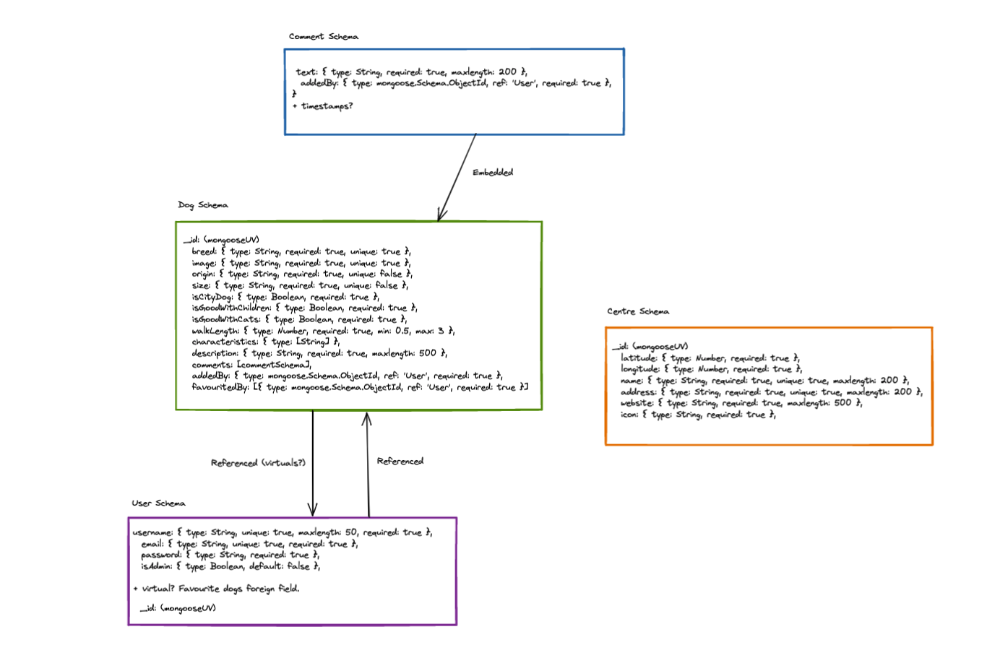

# Pawfect Pal

A solo coding project by Holly Stratton (9 days) 

Technologies used:
* JavaScript (ES6)
* HTML5
* MongoDB
* Express
* MapBox
* Bcrypt
* JSON Web Token
* Node.js
* React.js
* React Router
* React select
* SCSS
* Bulma (CSS Framework)
* Axios
* npm

## Deployment 

The project was deployed using Netlify and Heroku and can be found here: [found here.](https://pawfectpal.netlify.app/)

### Getting started

* Clone or download repository for [frontend](https://github.com/hollylouisarose/pawfectpal-frontend) and [backend](https://github.com/hollylouisarose/pawfectpal-backend) of Pawfect Pal.
* `npm i` to install dependencies.
* `npm run start` or `npm run dev`  to run in development.

## Overview 

For this project, the brief was to build a full-stack application, with an Express, MongoDB backend and a React.js frontend. The API needed to have multiple relationships, full CRUD functionality and multiple models.

With this in mind, I decided to create Pawfect Pal, a dog breed information app. Users can search for their perfect dog breed match. Users can save dog breeds to a private favourites page and leave comments on dog breeds to share their knowledge and opinions with other users. Once they have signed up, users can also add a dog to the index. They can also edit and delete dog breeds they have added. 

There is also a map of dog rescue centres in the UK for users to browse if they would like to adopt a dog.

### App walk through


## Approach

## The process

This project was substantially bigger than any I’d approached before, so planning was key. I started with my backend, planning my models and how they would interact.



During my planning phase, I established I would need four schemas: dog, user, centre and comment. I decided my comments data could be embedded onto my dog model as the comments are only relevant to the dog and it would make sense for them to be deleted if the dog was deleted.

I decided it would be best for the users and dog models to reference each other's data for the added by and favourited by field. As a user can add many dogs to their favourites and a dog can be favourited by many users.

With my database set up planned, I set about writing my code, testing as I went. 

## The Build

## Challenges

The main code challenges on this project were:

* Making my backend data as useful to the frontend as possible.
* Adding and removing dogs from the users' favourites.
* Adding and deleting comments on the dogs (and showing this change in the DOM).

## Making my backend data as useful to my frontend as possible.
While writing my controllers for my dog, particularly the controllers to add a comment and add a dog to the users, I realised that although they were working, they were only returning the user’s id with the comment made or the dog favorited. 

I realised this had limited use for my frontend. For example, on my dog’s comment, it would be useful to display the user’s username. To solve this, I used the Mongoose populate functionality to add the user’s information to the dog’s added by, favorited by and comment added by fields. 

``` javascript
async function getOneDog(req, res, next){
  const { dogId } = req.params
  try {
    const dogToShow = await Dog.findById(dogId)
      .populate('addedBy')
      .populate('favouritedBy')
      .populate('comments.addedBy')
    if (!dogToShow){
      throw new NotFound()
    }
    return res.status(200).json(dogToShow)
  } catch (err) {
    next(err)
  }
}

```
## Adding and removing dogs from the user’s favourites.

Favoriting and unfavoriting dogs posed both frontend and backend code challenges. On my dog schema, I decided to store an array of user id’s of the users that had liked that particular dog, this way many different users could keep a dog in their favourites.

With this in mind, I wrote conditional logic into my controller so it could add and remove the user’s id from the dogs favouritedBy array with the same request. The logic worked as follows: if the user’s id was already present, remove it, otherwise add it to the dog’s favouritedBy array. 

``` javascript
async function dogFavourite(req, res, next) {
  const { dogId } = req.params
  const { currentUserId, currentUser } = req
  try {
    const dogToFavourite = await Dog.findById(dogId).populate('favouritedBy')

    if (!dogToFavourite) {
      throw new NotFound()
    }

    if (dogToFavourite.favouritedBy.find(user => currentUserId.equals(user._id))) {
      dogToFavourite.favouritedBy.remove(currentUserId)
    } else {
      dogToFavourite.favouritedBy.push(currentUser)
    }

    await dogToFavourite.save()

    return res.status(202).json(dogToFavourite)
  } catch (err) {
    next(err)
  }
}
```
To complete this request successfully, my frontend needed to send the current dog data and user id to my backend. For favoriting I pushed the user’s id into the dog's favouritedBy array and sent this with the dog id, dog data and user id.

``` javascript
  const handleFavourite = async () => {
    setDogData(dogData.favouritedBy.push(userId))
    try {
      await favouriteDog(dogId, dogData) 
      history.push('/favourites')
    } catch (error) {
    }
  } 
```
However, I realised I was overcomplicating my frontend code when it came to removing the dog from the user’s favourites. Initially, I was convinced I needed to remove the user’s id from the dog’s favouritedBy array before sending my data. However, this caused conflict with the logic I had already established on my backend, which caused a type error and crashed the favourites page. I realised I was trying to remove the user’s id twice, which is not possible or necessary.

Therefore, to remove the dog, I simply needed to send the same data to my backend and allow the backend logic to remove the dog. I set the remove button’s id to be the dog’s id so I could differentiate between the user clicking on different dogs.

``` javascript
  const handleRemove =  async (e) => {
    const dogId = e.target.id
    try {
      const response = await favouriteDog(dogId) 
      setFavourites(response.data.favouritedBy)
    } catch (error) {
      console.log(error)
    }
  }

```

Correcting this error was a huge learning curve for me, it showed me where I had been overcomplicating my code and helped me greatly when implementing similar functionality on another project.

## Adding and deleting comments on the dogs (and showing this change in the DOM).

Manipulating my data and getting the changes to render in the DOM was a consistent challenge throughout building my frontend. My comments were one of the key pain points for this process. Initially, a user could add and delete comments, but the changes did not trigger a re-render of the page. I realised I needed to leverage my dependency array on my React.useEffect to force this re render.

I returned to my schema and realised that the thing that was changing on the frontend was the dog’s data. As comments were added and deleted, the length of the dog’s comments array was changing.

Therefore, to force a re-render, I could use React.state to track changes made to the dog data and set the dog data with the response data from my create comment and delete comment requests.

``` javascript
  const handleSubmitComment = async (event) => {
    event.preventDefault()
    try {
      await addComment(dogId, formData)
      const newDog = await getSingleDog(dogId)
      setDog(newDog.data)
    } catch (err) {
      console.log(err)
    }
  }

  const handleDeleteComment = async (event) => {
    const commentId = event.target.id
    try {
      await deleteComment(dogId, commentId)
      const newDog = await getSingleDog(dogId)
      setDog(newDog.data)
    } catch (err) {
      console.log(err)
    }
  }

```
This learning challenge was a great opportunity to explore using updates to my main page data to render changes in the DOM this way.

## Wins
Creating a project with this much functionality on my own was a huge win for me. In particular building CRUD functionality that incorporated multiple models with different embedded and related data was a great learning experience.

It was also a great opportunity to explore the flexibility of Express. As I went back to make adjustments to my models and controllers, I began to get a sense of how powerful this technology could be when a product is scaling up or adapting to different customer and business needs.

## Known bugs

* The image upload field on forms is slow. While the post request goes through very quickly, it takes a while for the image to appear in the DOM. I feel it needs some sort of loading state to discourage users from attempting multiple uploads.

* When on the edit dog form, the description box is not easy to use. The text runs inline rather than wrapping to stay inside the box, making it tricky to edit and read.

* Dog delete notification could be improved with an option to click a button to cancel, rather than clicking back or to another page (this leaves a lot of room for user error).

## Future Features

* A user profile page: building on the favourites page, it would be nice if users could see the dogs they have added to the index. This would make editing and deleting dogs easier.

* An option for users to add centres to the centres index.

* An option for users to add rating to dog breeds.

* More filters in the breed index: it would be great to be able to filter the dogs by whether they are cat or child friendly also (I could not crack this feature within the project timeframe).

## Key Learnings 

This project allowed me to test my current understanding of frontend and backend technologies to build a considerably bigger fullstack app than I have done to date. On the frontend, as well as deepening my understanding of dependency arrays and other React tools, it was a chance to explore mapbox and create image uploads for forms.

On the backend, working with Express and MongoDB was illuminating. I’m excited to build on my newfound knowledge to build larger projects and combine data in more complex ways.

In terms of my overall coding skills, one key learning was to be aware of overcomplicating my code. The more you’ve written, the more opportunities for breaks and therefore it is valuable to go back over your code, confirm every line has a place and strip it back to what is really needed. 

This project was bootstrapped with [Create React App](https://github.com/facebook/create-react-app).


